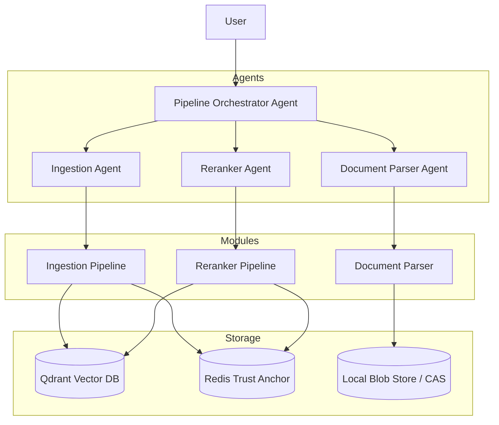

# Chanoch Clerk: Agentic RAG with Merkle-Tree Integrity

Chanoch Clerk is a high-throughput, low-latency document intelligence platform. It combines an **Agentic RAG Pipeline** with a **Merkle-tree storage engine** to provide verifiable data integrity, intelligent document parsing, and high-precision retrieval.

## Key Capabilities

- **Agentic Orchestration**: A multi-agent system powered by **Google ADK** that routes intents (Parse, Ingest, Retrieve) and executes multi-step workflows autonomously.
- **Merkle-Tree Integrity**: Every document is fingerprinted using a deterministic binary Merkle tree. Root hashes are stored in **Redis** as trust anchors, allowing for cryptographic audit of vectors stored in **Qdrant**.
- **Two-Stage Hybrid Retrieval**: Combines dense vector search with BM25 sparse keyword search (RRF) and Cross-Encoder reranking for high-precision results.
- **Git-Style Content Identity**: Uses Content-Addressed Storage (CAS) and content-based hashing to ensure that re-ingesting the same document is a no-op (idempotency).
- **Structurally-Aware Parsing**: Utilizes **PaddleOCR-VL** and layout detection to convert PDFs and images into rich, structured Markdown.
- **Model Context Protocol (MCP)**: Each core module is exposed as an MCP server, allowing for easy integration with tools like Claude Desktop.

---

## Architecture



For more details on the architectural decisions, see [ADR-001: Merkle-Tree Integrity and Multi-Agent Orchestration](docs/decisions/001-agentic-merkle-rag.md).

---

## Quick Start

### 1. Prerequisites

| Requirement | Minimum version | Notes |
|-------------|----------------|-------|
| Python | 3.13+ | Managed by `uv` |
| uv | latest | `pip install uv` |
| Docker | latest | For Qdrant and Redis |
| Node.js | latest | For MCP Inspector (optional) |

### 2. Setup Services

Start the required storage services using the included `docker-compose.yaml`:

```bash
docker compose up -d
```
This starts:
- **Qdrant** on port `6333` (REST) and `6334` (gRPC).
- **Redis** on port `6379`.

### 3. Install Dependencies

```bash
uv sync
```

### 4. Configuration

Copy `env.example` to `.env` and configure your keys (e.g., `GOOGLE_API_KEY` for Gemini orchestration):

```bash
cp env.example .env
```

---

## Core Modules & MCP Servers

Chanoch Clerk is composed of three primary modules, each featuring a dedicated MCP server.

### 1. Document Parser (`src/document_parser`)
Extracts markdown from PDFs/images. Uses OCR and layout detection.
- **MCP Tool**: `parse_document`, `parse_batch`
- **Identity**: Content-addressed (CAS).

### 2. Ingestion Pipeline (`src/ingestion_pipeline`)
Manages Qdrant storage and Merkle-tree integrity in Redis.
- **MCP Tool**: `ingest`, `search`, `audit`, `history`, `sync`
- **Integrity**: Verifies that Qdrant vectors match the Redis trust anchor.

### 3. Reranker Pipeline (`src/reranker_pipeline`)
Provides high-precision retrieval using Hybrid search + Cross-Encoder.
- **MCP Tool**: `rerank_search`
- **Ranking**: Weighted blend of RRF and Cross-Encoder scores.

---

## Agentic Workflows

The system is orchestrated by the `pipeline_orchestrator` agent in `src/agents/pipeline_orchestrator`.

### Running the Orchestrator (Web UI)
You can run the full agentic UI using the ADK web command:

```bash
uv run adk web src/agents/pipeline_orchestrator/agent.py
```

### Intent Categories
- **PARSE**: "Parse the document /path/to/file.pdf"
- **INGEST**: "Store this document in the system"
- **RETRIEVE**: "Find the section about balanced batching"
- **PIPELINE**: "Parse and ingest report.pdf and tell me the findings"

---

## Testing

The project includes a comprehensive suite of tests in the `/tests` directory.

```bash
# Run all tests
uv run pytest
```

Specific verification scripts:
- `tests/test_page_identity.py`: Visual vs Binary identity.
- `tests/test_ordinal_shift.py`: Merkle root behavior on content moves.
- `tests/test_ingestion_agent_integration.py`: End-to-end pipeline test.

---

## Directory Structure

```
├── docs/                # Architecture Decision Records (ADRs)
├── src/
│   ├── agents/          # ADK Agents (Orchestrator, Parser, Ingestor, Reranker)
│   ├── document_parser/ # OCR & Layout Extraction
│   ├── ingestion_pipeline/ # Merkle-Tree Storage & Integrity
│   ├── reranker_pipeline/  # Hybrid Reranking & Retrieval
│   ├── shared/          # Pydantic schemas, CAS, and common utils
│   └── utils/           # Visualization and Interactive tools
├── tests/               # Pytest suite and verification scripts
├── docker-compose.yaml  # Qdrant & Redis configuration
├── pyproject.toml       # Python dependencies
└── README.md            # This file
```

---

## Contributing

We welcome contributions! Please ensure that:
1. New features include corresponding tests in the `/tests` directory.
2. Architectural changes are documented with a new ADR in `/docs/decisions`.
3. Code follows the established patterns (Pydantic models, async-first, MCP-ready).
