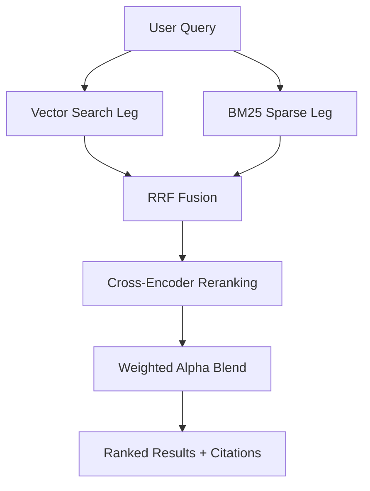

# Chanoch Clerk: Reranker Pipeline Module

The `reranker_pipeline` module is the high-precision retrieval engine for the Chanoch Clerk RAG system. It implements a **two-stage hybrid reranking pipeline** that combines broad semantic recall with deep-learning cross-encoder precision.

## Features

- **Hybrid Retrieval (RRF)**: Combines dense vector search (from `ingestion_pipeline`) with sparse keyword search (BM25) using Reciprocal Rank Fusion. This rewards documents that show both semantic relevance and exact term matches.
- **Cross-Encoder Reranking**: Re-scores the top candidates using a full-attention Cross-Encoder model (`ms-marco-MiniLM-L-6-v2`). This provides significantly higher precision than single-vector cosine similarity.
- **Citation-Aware Output**: Every result is packaged with a `CitationEnvelope` containing everything needed for verifiable citations: filename, page index, bounding boxes (`bbox`), and Merkle integrity roots.
- **Intelligent Score Caching**: Uses an in-process LRU cache to avoid re-scoring the same (query, chunk) pairs across different requests, dramatically reducing latency for frequent queries.
- **Tunable Blend (Alpha)**: Dynamically adjust the balance between the Cross-Encoder score and the RRF consensus score.

## Architecture



## Usage (Python API)

```python
import asyncio
import sys
sys.path.insert(0, "./src")

from ingestion_pipeline.ingestion_pipeline import AsyncMerkleQdrantIngestor
from reranker_pipeline.reranker_pipeline import HybridReranker

async def main():
    # 1. Initialize dependencies
    ingestor = AsyncMerkleQdrantIngestor(qdrant_url="http://localhost:6333")
    await ingestor.setup()

    # 2. Initialize Reranker
    reranker = HybridReranker(
        ingestor=ingestor,
        cross_encoder_model_name="cross-encoder/ms-marco-MiniLM-L-6-v2",
        alpha=0.7  # 70% Cross-Encoder, 30% RRF
    )

    # 3. Search and Rerank
    results = await reranker.rerank(
        query="What are the findings regarding balanced batching?",
        retrieval_top_k=50,  # Fetch 50 candidates per leg
        rerank_top_n=5       # Return top 5 after reranking
    )

    for r in results:
        print(f"Score: {r.final_score:.4f} | Content: {r.content[:100]}...")
        print(f"Source: {r.citation.filename} p.{r.citation.page_index}")

asyncio.run(main())
```

## Model Context Protocol (MCP) Server

The reranker module includes an MCP server (`server.py`) powered by `FastMCP`. This allows you to perform high-precision searches directly from MCP clients like Claude Desktop.

### Starting the Server (via Inspector)

```bash
npx @modelcontextprotocol/inspector .venv/bin/python src/reranker_pipeline/server.py
```

### Environment Variables

| Variable | Default | Description |
| :--- | :--- | :--- |
| `CE_MODEL_NAME` | `cross-encoder/ms-marco-MiniLM-L-6-v2` | HuggingFace Cross-Encoder model |
| `RERANK_ALPHA` | `0.7` | Default weight for Cross-Encoder scores |
| `RERANK_CACHE_SIZE` | `4096` | LRU cache size for (query, chunk) scores |

### Available MCP Tools

#### `rerank_search`
The primary tool for high-precision RAG. Executes the full hybrid + rerank pipeline.

```json
{
  "query": "pathology classification criteria",
  "rerank_top_n": 5,
  "include_citations_text": true
}
```

#### `rerank_configure`
Update reranker settings at runtime, including swapping the Cross-Encoder model or the underlying vector store connection.

```json
{
  "alpha": 0.8,
  "cross_encoder_model_name": "cross-encoder/ms-marco-MiniLM-L-12-v2"
}
```

#### `rerank_status`
View active configuration, cache utilization, and connectivity status for Qdrant and Redis.

#### `rerank_cache_clear`
Manually clear the score cache if you suspect stale results or have performed significant data updates.

## Performance Considerations

- **First Run**: The Cross-Encoder model (~80MB-300MB) will be downloaded from HuggingFace on the first run. Subsequent runs use the local cache.
- **Concurrency**: Inference is offloaded to `asyncio.to_thread`, ensuring the server remains responsive to other MCP requests while models are calculating scores.
- **Hardware**: For high-volume reranking, consider running on a machine with a GPU; `sentence-transformers` will automatically utilize CUDA or MPS if available.
